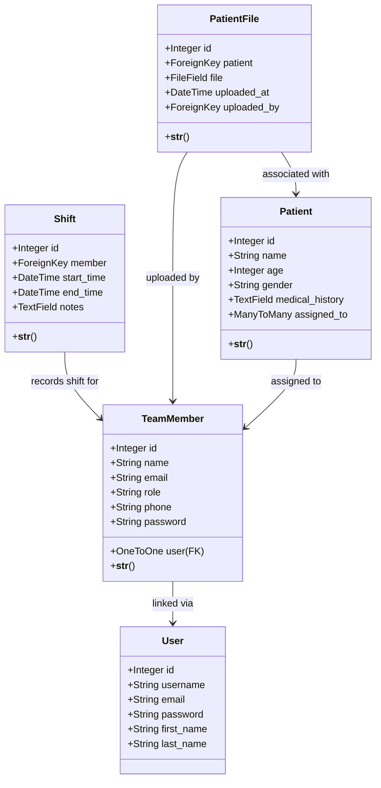

# MedApp

Système de gestion de pratique médicale basé sur Django, conçu pour rationaliser la coordination d'équipe, les dossiers patients et les affectations de praticiens.

## Fonctionnalités

- **Gestion des Membres de l'Équipe** : Ajouter, afficher et gérer les praticiens médicaux avec des affectations basées sur les rôles
- **Dossiers Patients** : Créer et maintenir des profils de patients détaillés incluant les antécédents médicaux
- **Affectation Patient-Praticien** : Affecter des patients à plusieurs membres de l'équipe pour des soins collaboratifs
- **Suivi des Équipes** : Enregistrer et surveiller les shifts et la disponibilité des membres de l'équipe
- **Gestion des Fichiers Patients** : Télécharger, organiser et consulter les fichiers patients de manière sécurisée directement depuis la page de détail du patient
- **Visualisation des Fichiers** : Ouvrir et télécharger les fichiers patients directement depuis le dossier patient
- **Authentification Sécurisée** : Authentification des utilisateurs avec création automatique de compte pour les membres de l'équipe
- **Interface Réactive** : Interface web conviviale et propre construite avec les templates Django

## Structure du Projet

```
myapp/
├── manage.py                 # Script de gestion Django
├── requirements.txt          # Dépendances Python
├── db.sqlite3               # Base de données SQLite
│
├── myapp/                   # Paramètres du projet Django
│   ├── settings.py          # Configuration du projet
│   ├── urls.py              # Routage d'URL principal
│   ├── asgi.py              # Configuration ASGI
│   └── wsgi.py              # Configuration WSGI
│
├── medapp/                  # Application Django principale
│   ├── models.py            # Modèles de données (TeamMember, Patient, Shift, PatientFile)
│   ├── views.py             # Logique des vues
│   ├── forms.py             # Formulaires Django
│   ├── urls.py              # Routage d'URL de l'application
│   ├── admin.py             # Configuration de l'administration Django
│   ├── migrations/          # Migrations de base de données
│   ├── static/              # CSS et actifs statiques
│   └── templates/           # Templates HTML
│       └── medapp/
│           ├── base.html
│           ├── patient/
│           │   ├── patient_list.html
│           │   ├── patient_detail.html
│           │   └── patient_form.html
│           └── team/
│               ├── team_member_list.html
│               └── team_member_detail.html
│
├── templates/               # Templates racines
│   └── login.html
└── static/                  # Fichiers statiques globaux
    └── css/
        └── style.css
```

## Modèles de Données

### Diagramme de Classes



### TeamMember
Représente les praticiens/membres du personnel médical avec création automatique de compte utilisateur Django.
- **Champs** : name, email, role, phone, password, user (FK vers User)

### Patient
Stocke les informations des patients et peut être affecté à plusieurs membres de l'équipe.
- **Champs** : name, age, gender, medical_history, assigned_to (M2M vers TeamMember)

### Shift
Enregistre les shifts de travail pour les membres de l'équipe.
- **Champs** : member (FK vers TeamMember), start_time, end_time, notes

### PatientFile
Gère les documents médicaux téléchargés associés aux patients.
- **Champs** : patient (FK vers Patient), file, uploaded_at, uploaded_by (FK vers TeamMember)

## Installation

### Prérequis
- Python 3.8+
- pip (gestionnaire de paquets Python)

### Instructions de Configuration

1. **Cloner le dépôt**
   ```bash
   git clone <repository-url>
   cd myapp
   ```

2. **Créer un environnement virtuel** (recommandé)
   ```bash
   python -m venv venv
   source venv/bin/activate  # Sur Windows : venv\Scripts\activate
   ```

3. **Installer les dépendances**
   ```bash
   pip install -r requirements.txt
   ```

4. **Appliquer les migrations**
   ```bash
   python manage.py migrate
   ```

5. **Créer un compte superutilisateur** (pour l'accès administrateur)
   ```bash
   python manage.py createsuperuser
   ```

6. **Lancer le serveur de développement**
   ```bash
   python manage.py runserver
   ```
   L'application sera disponible à `http://127.0.0.1:8000/`

## Utilisation

### Accéder à l'Application
- **Application principale** : `http://localhost:8000/`
- **Panneau d'administration** : `http://localhost:8000/admin/` (nécessite une connexion superutilisateur)

### Flux de Travail Principaux

**Ajouter un Membre de l'Équipe :**
1. Allez à Panneau Admin → TeamMember → Ajouter un Membre de l'Équipe
2. Remplissez le nom, l'email, le rôle et le téléphone
3. Définissez un mot de passe (sera utilisé pour la création de compte)
4. Enregistrer - un compte utilisateur Django est automatiquement créé

**Créer un Patient :**
1. Accédez à la Liste des Patients
2. Cliquez sur "Ajouter un Patient"
3. Remplissez les informations du patient
4. Affectez les membres de l'équipe qui seront responsables des soins
5. Enregistrez le dossier patient

**Affecter un Patient à un Praticien :**
1. Modifiez le dossier du patient
2. Sélectionnez les membres de l'équipe dans le champ "Affecté à"
3. Plusieurs praticiens peuvent être affectés au même patient

**Enregistrer les Shifts :**
1. Ajoutez les shifts via l'administration Django
2. Sélectionnez le membre de l'équipe et définissez les heures de début/fin
3. Ajoutez des notes optionnelles sur le shift

**Gérer les Fichiers Patients :**
1. Accédez à la page de détail du patient
2. Allez à la section "Patient Files"
3. Dans la section "Upload New File", sélectionnez un fichier et cliquez sur "Upload File"
4. Le fichier est téléchargé et enregistré avec l'horodatage et le nom de celui qui a téléchargé
5. Cliquez sur le nom du fichier dans la liste pour l'ouvrir ou le télécharger
6. Les fichiers s'ouvrent dans un nouvel onglet pour visualisation ou téléchargement

## Caractéristiques Clés

### Gestion Automatique des Utilisateurs
Lorsqu'un membre de l'équipe est créé, le système automatiquement :
- Génère un nom d'utilisateur unique à partir du nom du membre
- Crée un compte utilisateur Django correspondant
- Lie le compte utilisateur au TeamMember pour l'authentification


### Affectation Multi-Praticienne
Les patients peuvent être affectés à plusieurs membres de l'équipe, permettant :
- Soins collaboratifs
- Recherche facile de praticien pour chaque patient
- Vue du praticien de tous les patients affectés


  


  
  
  


  


  

  


## Déploiement

L'application est officiellement déployée et accessible en ligne via **PythonAnywhere** :
**Lien de l'application :** [https://zakariabenarbia.pythonanywhere.com]</p>


